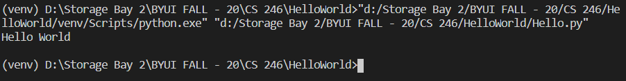

# Overview
This program says hello to the world. It demonstrates Python with VSCode and GitHub.

# Development Environment
* Visual Studio Code
* Python 3.8.5

# Execution
To execute the program: `python Hello.py`

# Useful Websites

1. [Python Reference](https://docs.python.org/3/library/index.html)